# Pokemon Classification


## 一、开发与运行环境

本实验使用 `python==3.9.0`，其他包版本参见 `requirements.txt`

```python
pandas==2.2.0
Pillow==10.2.0
torch==1.7.1+cu101
torchinfo==1.8.0
torchvision==0.8.2+cu101
```

但是 `torch` 和 `torchvision` 版本需要根据本机 cuda 版本确定。

在 `code` 文件夹下，运行命令

1. `conda create -n hy_hw3 python==3.9.0` 
2. `conda activate hy_hw3`
3. `pip install -r requirements.txt` 

即可配置好环境。

## 二、实验过程

### 了解并实现 ResNet

参考的博客是：[ResNet——CNN经典网络模型详解(pytorch实现)_resnet模型-CSDN博客](https://blog.csdn.net/weixin_44023658/article/details/105843701)

基础知识：

1. ResNet 解决的问题：神经网络深度增加效果反而退化
2. ResNet 的解决方法：使用残差结构，使神经网络更容易训练

本次实验实现一个 ResNet18，实现细节如下：

1. 残差结构：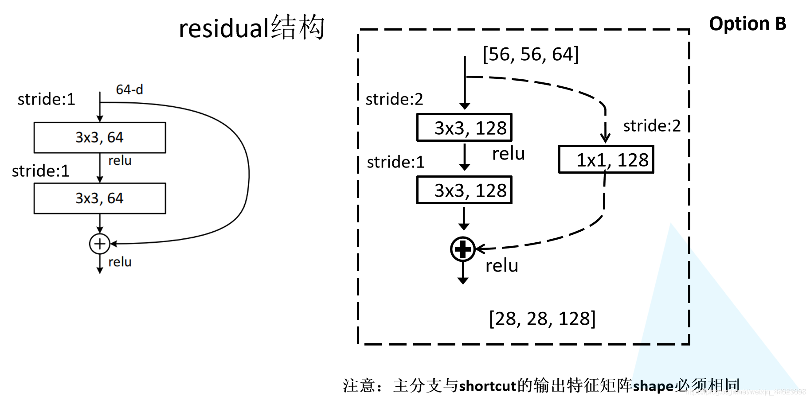
2. 网络结构超参数：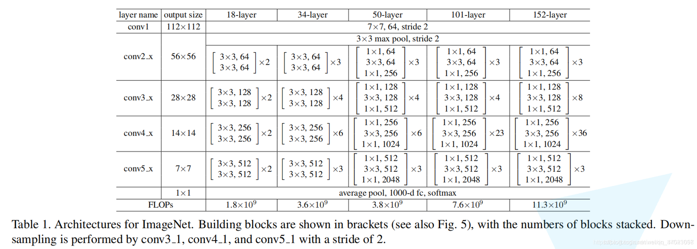
   - p.s. 网络输入为 `224*224*in_channel` 的图像，输出为 `num_classes` 维向量，表示每种种类的可能性

具体实现如下：

```python
class BasicBlock(nn.Module):
    """
    ResNet 的基础模块，也就是 residual 结构，分为降维和不降维两种
    """
    def __init__(self, in_channel, out_channel, is_downsample):
        super(BasicBlock, self).__init__()

        # 参数
        self.is_downsample = is_downsample
        self.stride = 2 if is_downsample else 1

        # 模块
        self.conv1 = nn.Conv2d(in_channels=in_channel, out_channels=out_channel, kernel_size=3, stride=self.stride, padding=1)
        self.bn1 = nn.BatchNorm2d(out_channel)
        self.relu = nn.ReLU()
        self.conv2 = nn.Conv2d(in_channels=out_channel, out_channels=out_channel, kernel_size=3, stride=1, padding=1)
        self.bn2 = nn.BatchNorm2d(out_channel)
        self.identity = nn.Conv2d(in_channels=in_channel, out_channels=out_channel, kernel_size=1, stride=self.stride)

    def forward(self, x):
        identity =self.identity(x)
        x = self.conv1(x)
        x = self.bn1(x)
        x = self.relu(x)
        x = self.conv2(x)
        x = self.bn2(x)
        x += identity
        x = self.relu(x)
        return x


class ResNet18(nn.Module):
    """
    用 BasicBlock 组成 ResNet
    """
    def __init__(self, in_channel, num_classes):
        super(ResNet18, self).__init__()
        self.conv1 = nn.Conv2d(in_channels=in_channel, out_channels=64, kernel_size=7, stride=2, padding=3)
        self.conv2 = nn.Sequential(
            nn.MaxPool2d(kernel_size=3, stride=2, padding=1),
            BasicBlock(in_channel=64, out_channel=64, is_downsample=False),
            BasicBlock(in_channel=64, out_channel=64, is_downsample=False)
        )
        self.conv3 = nn.Sequential(
            BasicBlock(in_channel=64, out_channel=128, is_downsample=True),
            BasicBlock(in_channel=128, out_channel=128, is_downsample=False)
        )
        self.conv4 = nn.Sequential(
            BasicBlock(in_channel=128, out_channel=256, is_downsample=True),
            BasicBlock(in_channel=256, out_channel=256, is_downsample=False)
        )
        self.conv5 = nn.Sequential(
            BasicBlock(in_channel=256, out_channel=512, is_downsample=True),
            BasicBlock(in_channel=512, out_channel=512, is_downsample=False)
        )
        self.predictor = nn.Sequential(
            nn.AdaptiveAvgPool2d((1, 1)),
            nn.Flatten(),
            nn.Linear(512, num_classes),
            nn.Softmax(dim=1)
        )

    def forward(self, x):
        x = self.conv1(x)
        x = self.conv2(x)
        x = self.conv3(x)
        x = self.conv4(x)
        x = self.conv5(x)
        x = self.predictor(x)
        return x
```

输出结构检查一下：

```python
================================================================================
Layer (type (var_name))                  Input Shape          Output Shape
================================================================================
ResNet18 (ResNet18)                      [32, 3, 224, 224]    [32, 1000]
├─Conv2d (conv1)                         [32, 3, 224, 224]    [32, 64, 112, 112]
├─Sequential (conv2)                     [32, 64, 112, 112]   [32, 64, 56, 56]
│    └─MaxPool2d (0)                     [32, 64, 112, 112]   [32, 64, 56, 56]
│    └─BasicBlock (1)                    [32, 64, 56, 56]     [32, 64, 56, 56]
│    │    └─Conv2d (identity)            [32, 64, 56, 56]     [32, 64, 56, 56]
│    │    └─Conv2d (conv1)               [32, 64, 56, 56]     [32, 64, 56, 56]
│    │    └─BatchNorm2d (bn1)            [32, 64, 56, 56]     [32, 64, 56, 56]
│    │    └─ReLU (relu)                  [32, 64, 56, 56]     [32, 64, 56, 56]
│    │    └─Conv2d (conv2)               [32, 64, 56, 56]     [32, 64, 56, 56]
│    │    └─BatchNorm2d (bn2)            [32, 64, 56, 56]     [32, 64, 56, 56]
│    │    └─ReLU (relu)                  [32, 64, 56, 56]     [32, 64, 56, 56]
│    └─BasicBlock (2)                    [32, 64, 56, 56]     [32, 64, 56, 56]
│    │    └─Conv2d (identity)            [32, 64, 56, 56]     [32, 64, 56, 56]
│    │    └─Conv2d (conv1)               [32, 64, 56, 56]     [32, 64, 56, 56]
│    │    └─BatchNorm2d (bn1)            [32, 64, 56, 56]     [32, 64, 56, 56]
│    │    └─ReLU (relu)                  [32, 64, 56, 56]     [32, 64, 56, 56]
│    │    └─Conv2d (conv2)               [32, 64, 56, 56]     [32, 64, 56, 56]
│    │    └─BatchNorm2d (bn2)            [32, 64, 56, 56]     [32, 64, 56, 56]
│    │    └─ReLU (relu)                  [32, 64, 56, 56]     [32, 64, 56, 56]
├─Sequential (conv3)                     [32, 64, 56, 56]     [32, 128, 28, 28]
│    └─BasicBlock (0)                    [32, 64, 56, 56]     [32, 128, 28, 28]
│    │    └─Conv2d (identity)            [32, 64, 56, 56]     [32, 128, 28, 28]
│    │    └─Conv2d (conv1)               [32, 64, 56, 56]     [32, 128, 28, 28]
│    │    └─BatchNorm2d (bn1)            [32, 128, 28, 28]    [32, 128, 28, 28]
│    │    └─ReLU (relu)                  [32, 128, 28, 28]    [32, 128, 28, 28]
│    │    └─Conv2d (conv2)               [32, 128, 28, 28]    [32, 128, 28, 28]
│    │    └─BatchNorm2d (bn2)            [32, 128, 28, 28]    [32, 128, 28, 28]
│    │    └─ReLU (relu)                  [32, 128, 28, 28]    [32, 128, 28, 28]
│    └─BasicBlock (1)                    [32, 128, 28, 28]    [32, 128, 28, 28]
│    │    └─Conv2d (identity)            [32, 128, 28, 28]    [32, 128, 28, 28]
│    │    └─Conv2d (conv1)               [32, 128, 28, 28]    [32, 128, 28, 28]
│    │    └─BatchNorm2d (bn1)            [32, 128, 28, 28]    [32, 128, 28, 28]
│    │    └─ReLU (relu)                  [32, 128, 28, 28]    [32, 128, 28, 28]
│    │    └─Conv2d (conv2)               [32, 128, 28, 28]    [32, 128, 28, 28]
│    │    └─BatchNorm2d (bn2)            [32, 128, 28, 28]    [32, 128, 28, 28]
│    │    └─ReLU (relu)                  [32, 128, 28, 28]    [32, 128, 28, 28]
├─Sequential (conv4)                     [32, 128, 28, 28]    [32, 256, 14, 14]
│    └─BasicBlock (0)                    [32, 128, 28, 28]    [32, 256, 14, 14]
│    │    └─Conv2d (identity)            [32, 128, 28, 28]    [32, 256, 14, 14]
│    │    └─Conv2d (conv1)               [32, 128, 28, 28]    [32, 256, 14, 14]
│    │    └─BatchNorm2d (bn1)            [32, 256, 14, 14]    [32, 256, 14, 14]
│    │    └─ReLU (relu)                  [32, 256, 14, 14]    [32, 256, 14, 14]
│    │    └─Conv2d (conv2)               [32, 256, 14, 14]    [32, 256, 14, 14]
│    │    └─BatchNorm2d (bn2)            [32, 256, 14, 14]    [32, 256, 14, 14]
│    │    └─ReLU (relu)                  [32, 256, 14, 14]    [32, 256, 14, 14]
│    └─BasicBlock (1)                    [32, 256, 14, 14]    [32, 256, 14, 14]
│    │    └─Conv2d (identity)            [32, 256, 14, 14]    [32, 256, 14, 14]
│    │    └─Conv2d (conv1)               [32, 256, 14, 14]    [32, 256, 14, 14]
│    │    └─BatchNorm2d (bn1)            [32, 256, 14, 14]    [32, 256, 14, 14]
│    │    └─ReLU (relu)                  [32, 256, 14, 14]    [32, 256, 14, 14]
│    │    └─Conv2d (conv2)               [32, 256, 14, 14]    [32, 256, 14, 14]
│    │    └─BatchNorm2d (bn2)            [32, 256, 14, 14]    [32, 256, 14, 14]
│    │    └─ReLU (relu)                  [32, 256, 14, 14]    [32, 256, 14, 14]
├─Sequential (conv5)                     [32, 256, 14, 14]    [32, 512, 7, 7]
│    └─BasicBlock (0)                    [32, 256, 14, 14]    [32, 512, 7, 7]
│    │    └─Conv2d (identity)            [32, 256, 14, 14]    [32, 512, 7, 7]
│    │    └─Conv2d (conv1)               [32, 256, 14, 14]    [32, 512, 7, 7]
│    │    └─BatchNorm2d (bn1)            [32, 512, 7, 7]      [32, 512, 7, 7]
│    │    └─ReLU (relu)                  [32, 512, 7, 7]      [32, 512, 7, 7]
│    │    └─Conv2d (conv2)               [32, 512, 7, 7]      [32, 512, 7, 7]
│    │    └─BatchNorm2d (bn2)            [32, 512, 7, 7]      [32, 512, 7, 7]
│    │    └─ReLU (relu)                  [32, 512, 7, 7]      [32, 512, 7, 7]
│    └─BasicBlock (1)                    [32, 512, 7, 7]      [32, 512, 7, 7]
│    │    └─Conv2d (identity)            [32, 512, 7, 7]      [32, 512, 7, 7]
│    │    └─Conv2d (conv1)               [32, 512, 7, 7]      [32, 512, 7, 7]
│    │    └─BatchNorm2d (bn1)            [32, 512, 7, 7]      [32, 512, 7, 7]
│    │    └─ReLU (relu)                  [32, 512, 7, 7]      [32, 512, 7, 7]
│    │    └─Conv2d (conv2)               [32, 512, 7, 7]      [32, 512, 7, 7]
│    │    └─BatchNorm2d (bn2)            [32, 512, 7, 7]      [32, 512, 7, 7]
│    │    └─ReLU (relu)                  [32, 512, 7, 7]      [32, 512, 7, 7]
├─Sequential (predictor)                 [32, 512, 7, 7]      [32, 1000]
│    └─AdaptiveAvgPool2d (0)             [32, 512, 7, 7]      [32, 512, 1, 1]
│    └─Flatten (1)                       [32, 512, 1, 1]      [32, 512]
│    └─Linear (2)                        [32, 512]            [32, 1000]
│    └─Softmax (3)                       [32, 1000]           [32, 1000]
================================================================================
Total params: 12,045,672
Trainable params: 12,045,672
Non-trainable params: 0
Total mult-adds (G): 60.20
================================================================================
Input size (MB): 19.27
Forward/backward pass size (MB): 1169.16
Params size (MB): 48.18
Estimated Total Size (MB): 1236.61
================================================================================
```

网络结构大致符合预期。


### 了解并处理数据集

参考：

1. [pokemon-types/01-munge-data.ipynb (github.com)](https://github.com/rshnn/pokemon-types/blob/master/01-munge-data.ipynb) 参考仓库中的数据预处理模块
2. [Pokemon Classification model using Tensorflow | Kaggle](https://www.kaggle.com/code/shubhamptrivedi/pokemon-classification-model-using-tensorflow)
3. [Datasets & DataLoaders — PyTorch Tutorials 2.2.0+cu121 documentation](https://pytorch.org/tutorials/beginner/basics/data_tutorial.html) 自定义 Dataset 参考官方文档
4. [MultiLabelSoftMarginLoss — PyTorch 2.1 documentation](https://pytorch.org/docs/stable/generated/torch.nn.MultiLabelSoftMarginLoss.html) 损失函数参考


首先来看一下有哪些可以用的东西：

1. `pokemon.csv`: 标签信息。用 pandas 的 dataframe 来读取和存储 csv 中的表格数据

   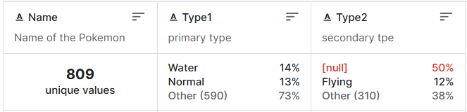

2. `/images`: 包含 809 个 `120*120` 的图像，每个宝可梦一张图片

3. `train.csv` & `test.csv`: 划分训练集和测试集，其中训练集包含 687 个宝可梦，测试集包含 122 个宝可梦，没有重复


然后要解决的一个问题是标签怎么设计：

1. 我最开始用的方法是：把 `[type1, type2]` 形成的一个有序对作为标签，但是这样做有个问题，就是标签的个数有 159 个，而数据集总共也就 809 个图片，显然要分这么细就有点不太合理了。然后可以发现 type1 和 type2 的值域是一样的，其含义应该是宝可梦的主要属性和次要属性。可以简化分类标准，对每个宝可梦预测两个属性，概率最大的作为主要属性，概率次大的作为次要属性。
2. 最终使用的方法：总共 18 个标签，但是每张图像可以有多个标签。所以我们需要重新自定义一个 CustomDataset 类型来装 multi-label 的数据


实现：

```python
class CustomDataset(Dataset):
    def __init__(self, img_dir, data_frame):
        """
        :param img_dir: 图片目录
        :param data_frame: 图片名字和标签的列表，需要包含列 'Name', 'Type1', 'Type2'
        :other dataset_expansion: 每个图片经过数据增广之后生成多少张图片
        :other transform: 用于数据增广的操作
        :other index_to_label: 用于标签的编号到字符串的转换
        :other label_to_index: 用于标签的字符串到编号的转换
        """
        self.img_dir = img_dir
        self.data_frame = data_frame
        self.dataset_expansion = 10  # 通过 image augmentation 生成多少倍数量的图像
        self.transform = transforms.Compose([  # image augmentation
            transforms.RandomResizedCrop(size=(224, 224), scale=(0.8, 1.0), ratio=(0.75, 1.33)),  # 随机裁剪，顺便调整大小
            transforms.RandomHorizontalFlip(p=0.5),  # 以 0.5 的概率水平翻转
            transforms.RandomRotation(90),  # 随机旋转 (-90, +90) 度
            transforms.ColorJitter(brightness=0.3, contrast=0, saturation=0, hue=0),  # 随机改变图像的亮度、对比度、饱和度和色调
            transforms.ToTensor(),
            transforms.Normalize((0.5, 0.5, 0.5), (0.5, 0.5, 0.5))
        ])
        self.index_to_label = {
            0: 'Bug',
            1: 'Dark',
            2: 'Dragon',
            3: 'Electric',
            4: 'Fairy',
            5: 'Fighting',
            6: 'Fire',
            7: 'Flying',
            8: 'Ghost',
            9: 'Grass',
            10: 'Ground',
            11: 'Ice',
            12: 'Normal',
            13: 'Poison',
            14: 'Psychic',
            15: 'Rock',
            16: 'Steel',
            17: 'Water'
        }
        self.label_to_index = {
            'Bug': 0,
            'Dark': 1,
            'Dragon': 2,
            'Electric': 3,
            'Fairy': 4,
            'Fighting': 5,
            'Fire': 6,
            'Flying': 7,
            'Ghost': 8,
            'Grass': 9,
            'Ground': 10,
            'Ice': 11,
            'Normal': 12,
            'Poison': 13,
            'Psychic': 14,
            'Rock': 15,
            'Steel': 16,
            'Water': 17
        }

    def __len__(self):
        return len(self.data_frame) * self.dataset_expansion

    def __getitem__(self, idx):
        real_idx = idx // self.dataset_expansion

        # get image after augmentation
        pokemon_name = self.data_frame.iloc[real_idx].at['Name']
        if os.path.exists('pokemon/images/' + pokemon_name + '.png'):
            file_name = 'pokemon/images/' + pokemon_name + '.png'
            img = Image.open(file_name).convert('RGB')  # PNG 是 RGBA 4 通道的，需要先转成 3 通道再进行 transform
        elif os.path.exists('pokemon/images/' + pokemon_name + '.jpg'):
            file_name = 'pokemon/images/' + pokemon_name + '.jpg'
            img = Image.open(file_name)
        else:
            print("no such image file!")
            exit(1)
        aug_img = self.transform(img)

        # get multi-label
        label = torch.zeros((18, ))
        label[self.label_to_index[self.data_frame.iloc[real_idx].at['Type1']]] = 1
        if pd.notnull(self.data_frame.iloc[real_idx].at['Type2']):
            label[self.label_to_index[self.data_frame.iloc[real_idx].at['Type2']]] = 1

        return aug_img, label

```

最终结果：

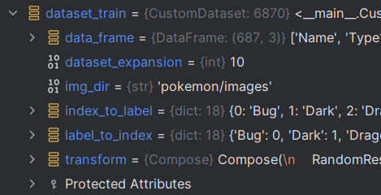


### 了解并实现 Image Augmentation

参考：

1. [9.1. 图像增广 — 《动手学深度学习》 文档 (gluon.ai)](http://zh.gluon.ai/chapter_computer-vision/image-augmentation.html)
2. [Pokemon Classifier | Medium](https://medium.com/@rjrjrjrj1996/pokemon-classifier-with-pytorch-656ed7fcc7bb) 博客中的数据增广部分

实现：

```python
        self.transform = transforms.Compose([  # image augmentation
            transforms.RandomResizedCrop(size=(224, 224), scale=(0.8, 1.0), ratio=(0.75, 1.33)),  # 随机裁剪，顺便调整大小
            transforms.RandomHorizontalFlip(p=0.5),  # 以 0.5 的概率水平翻转
            transforms.RandomRotation(90),  # 随机旋转 (-90, +90) 度
            transforms.ColorJitter(brightness=0.3, contrast=0, saturation=0, hue=0),  # 随机改变图像的亮度、对比度、饱和度和色调
            transforms.ToTensor(),
            transforms.Normalize((0.5, 0.5, 0.5), (0.5, 0.5, 0.5))
        ])
```

在数据预处理的时候对每张图片多次执行这个 transform 就可以了。结果如下：

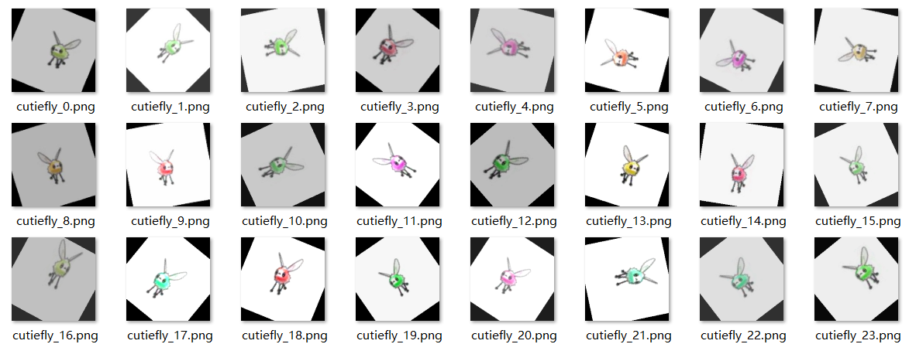

后面又做了一定的修改，不再修改图片的对比度、饱和度和色调，因为部分属性可能是根据颜色来判断的。


### 训练和测试

因为都是监督学习，所以训练和测试过程和上次的作业基本是一样的。需要修改的地方有：

1. 因为变成了 multi-label 的问题，所以 loss function 和判断 accuracy 的方法需要做一点改变

   ```python
   # 损失函数
   criterion = torch.nn.MultiLabelSoftMarginLoss().to(device)
   
   # 判断是否分类正确
   def get_result(x):
       """
       用于把模型输出的概率变成唯一答案
       输入 x 是一个 (BATCH_SIZE, CLASS_SIZE) 的张量
       对他每个 batch 求一个 argmax，得到一个 (BATCH_SIZE, 2) 的张量 ret
       """
       _, idx = torch.sort(x, descending=True)
       for i in range(x.shape[0]):
           if _[i, 1] < eps:
               idx[i, 1] = -1
       return idx[:, :2]
   
   
   def compare_result(x, y):
       """
       输入 x, y 是 2 个 (BATCH_SIZE, 2) 的张量
       默认 x 是模型输出的数据，y 是标签
       输出一个数字表示有多少判断是正确的
       """
       cnt = 0
       for i in range(y.shape[0]):
           if y[i, 1] == -1:
               if x[i, 0] == y[i, 0] or x[i, 1] == y[i, 0]:
                   cnt = cnt + 1
           else:
               if x[i, 0] == y[i, 0] and x[i, 1] == y[i, 1] or x[i, 0] == y[i, 1] and x[i, 1] == y[i, 0]:
                   cnt = cnt + 1
       return cnt
   ```

2. 因为把单标签改成了多标签，所以模型最后的 softmax 需要去掉。不去掉训了跟没训一样

   

### 后续实验：调整超参数&测试集泄露

#### 测试集泄露 vs. 不泄露

- 测试集泄露的测试集准确率

```python
test_loss: 0.00190, test_acc: 0.9832
```


- 没有测试集泄露的测试集准确率

```python
test_loss: 0.7921, test_acc: 0.1274
```


#### 调参

下面是一些尝试得出的初步结论，但是因为单次训练比较慢，所以没有进行完整的训练：

1. 学习率：`lr=0.01` 的时候感觉正确率变化很慢，改大学习率之后效果看起来好了很多
2. 数据归一化：归一化之后数据收敛速度变快了，体现在前几个 epoch 的正确率上升变快了


## 三、实验结果与分析

前 20 个 Epoch 结束后，模型的训练集准确率为 63%，测试集准确率为 10%：

```python
Epoch: 19| Train loss:  0.09302| Train acc:  0.63692
test_loss: 0.4427, test_acc: 0.1026
```

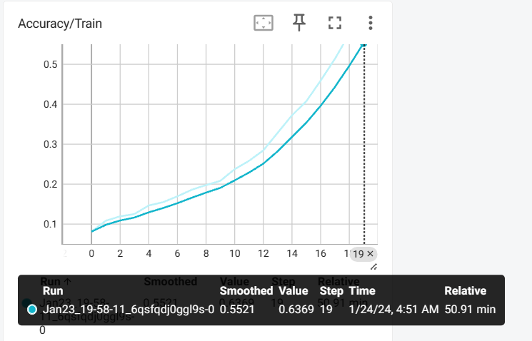

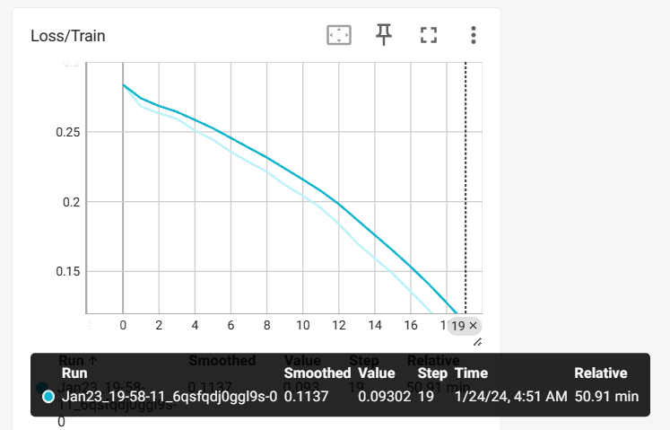


第 21 到 30 个 Epoch 结束后，模型的训练集准确率为 92%，测试集准确率为 12%：

```python
Epoch: 9| Train loss:  0.02452| Train acc:  0.92340
test_loss: 0.6546, test_acc: 0.1242
```

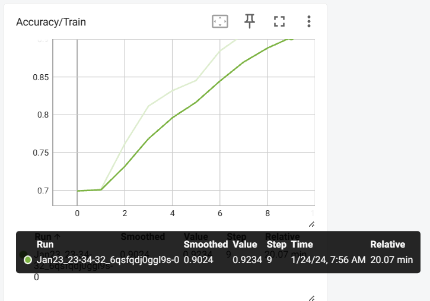

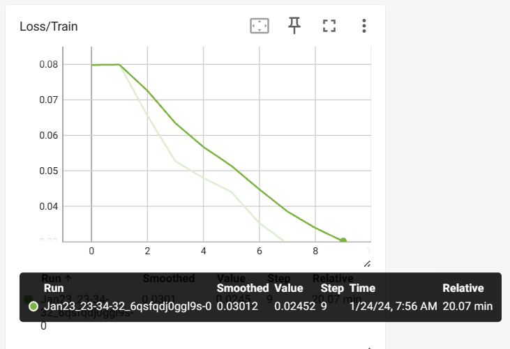

第 31 到 40 个 Epoch 结束后，模型的训练集准确率为 99%，测试集准确率为 12%：

```python
Epoch: 9| Train loss:  0.00170| Train acc:  0.99666
test_loss: 0.7921, test_acc: 0.1274
```

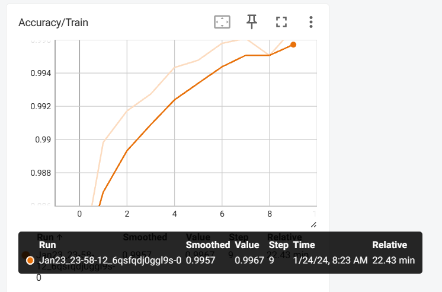

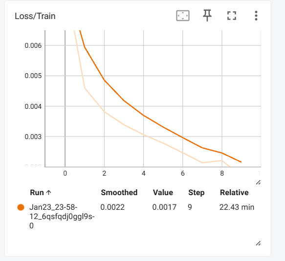


## 四、结论与心得体会

本次实验碰到了不少问题：

1. 最主要的就是标签怎么定义的问题，最开始写完代码之后发现跑出来效果非常垃圾，一下子不知道该从哪里下手去修改
2. 然后就是像 ResNet 这样参数较多的网络，训练需要的训练量和 Epoch 数量更多了，训练量不够的情况下效果非常垃圾。面对训练结果还是挺懵逼的
3. 过拟合非常严重，也不知道是哪里出了问题。按理来说我的每个 Epoch 的数据集都是随机生成的，训练集上正确率比较好说明模型应对图像变换的能力是可以的，但是看起来并没有学到每个属性的特征，换成没有见过的宝可梦的时候预测效果就完全不行了。


也学到了很多东西：

1. 大概了解了 ResNet，更熟悉了搭建神经网络的步骤
2. 学会了自定义 Dataset


## 五、参考文献

1. [ResNet——CNN经典网络模型详解(pytorch实现)_resnet模型-CSDN博客](https://blog.csdn.net/weixin_44023658/article/details/105843701)
2. [pokemon-types/01-munge-data.ipynb (github.com)](https://github.com/rshnn/pokemon-types/blob/master/01-munge-data.ipynb) 参考仓库中的数据预处理模块
3. [Pokemon Classification model using Tensorflow | Kaggle](https://www.kaggle.com/code/shubhamptrivedi/pokemon-classification-model-using-tensorflow)
4. [Datasets & DataLoaders — PyTorch Tutorials 2.2.0+cu121 documentation](https://pytorch.org/tutorials/beginner/basics/data_tutorial.html) 自定义 Dataset 参考官方文档
5. [MultiLabelSoftMarginLoss — PyTorch 2.1 documentation](https://pytorch.org/docs/stable/generated/torch.nn.MultiLabelSoftMarginLoss.html) 损失函数参考
6. [9.1. 图像增广 — 《动手学深度学习》 文档 (gluon.ai)](http://zh.gluon.ai/chapter_computer-vision/image-augmentation.html)
7. [Pokemon Classifier | Medium](https://medium.com/@rjrjrjrj1996/pokemon-classifier-with-pytorch-656ed7fcc7bb) 博客中的数据增广部分

